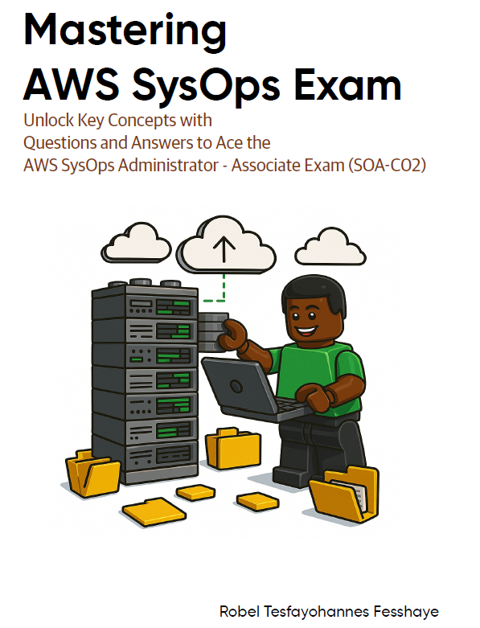

### Mastering AWS SysOps - Your Fast Track to Certification Success

If you’re preparing for the AWS Certified SysOps Administrator - Associate exam (SOA-C02), there’s a new must-have resource on Amazon: Mastering AWS SysOps. Whether you’re just starting your cloud journey or refining your operations skills, this book is designed to get you exam-ready—fast.

What sets this book apart is its Q&A format, crafted to make complex AWS services easier to understand and remember. Instead of long-winded explanations, you’ll get concise, exam-focused answers that help reinforce your knowledge quickly. It also includes powerful cheat sheets, perfect for last-minute review or as a quick reference on the job.

From EC2 and S3 to CloudWatch, IAM, and beyond, every AWS service covered in the exam is broken down into manageable chunks. With Mastering AWS SysOps, you won’t just study – you’ll actually retain the information and walk into your exam with confidence.

If you’re serious about passing the SysOps exam and want a study guide that’s smart, practical, and designed for real-world learners, check it out on Amazon today.

[Grab your copy of Mastering AWS SysOps on Amazon](https://www.amazon.com/dp/B0F5CTVRFN?ref=ppx_yo2ov_dt_b_fed_asin_title).

